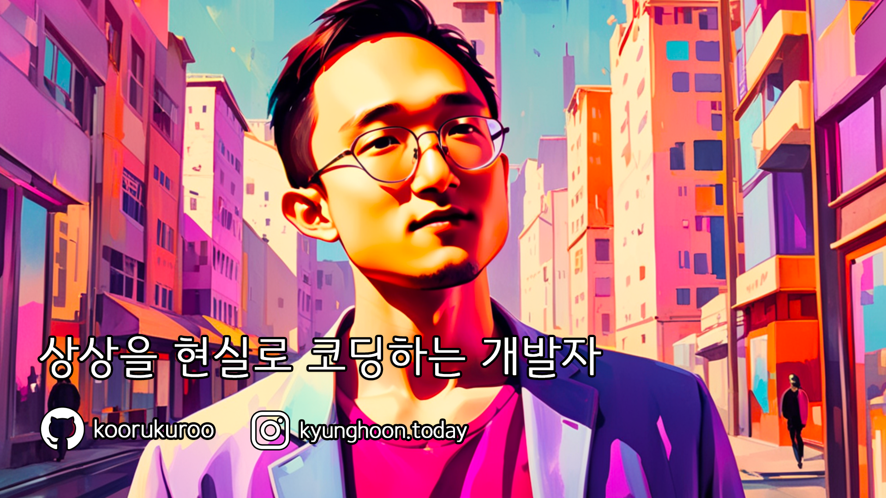

### 안녕하세요, 상상을 현실로 코딩하는 개발자 koorukuroo입니다 👋

## 🌟 나의 비전
"**기술을 통해 세상에 긍정적인 변화를 만들어 나가는 것**"
- 혁신적인 솔루션으로 사람들의 삶을 더 풍요롭게 만들고자 합니다.
- 더 나은 세상을 만들기 위한 기술의 힘을 믿습니다.

## 💫 철학
에피쿠로스의 말처럼 "우리가 삶에서 추구해야 할 가장 큰 즐거움은 정신적인 평안입니다."  
코드 한 줄, 한 줄에 저의 가치관을 담아, 사용자가 더 단순하고 풍요로운 삶을 누릴 수 있는 솔루션을 만들어 나갑니다.  
진정한 행복은 외부의 성공이 아닌, 우리의 내면에서 비롯된다고 믿으며, 기술을 통해 사람들이 그 행복을 찾을 수 있도록 돕고자 합니다.

- 🌱 지속적인 학습과 성장을 추구합니다. 단순함 속에서 큰 즐거움을 찾고, 불필요한 욕구는 멀리하여 정신적 만족을 최우선으로 삼습니다.  
- 🔭 AI 스타트업 [코어닷투데이](https://github.com/CoreDotToday/)를 운영하며, 오토매틱과 같은 혁신적인 회사를 만들어 가는 것이 제 소명입니다.

## ☕ 아침의 시작
- 🥥 Bulletin Coffee로 하루를 시작하며, 맛있는 커피와 함께 시작하는 하루가 제가 매일 아침 기대하는 작은 행복입니다.

## 🚀 미션
- **혁신**: 사용자 중심의 기술 개발로 일상의 문제를 해결합니다.
- **공유**: 지식과 경험을 공유하여 커뮤니티와 함께 성장합니다.
- **균형**: 개발자로서의 열정과 개인적인 행복 사이에서 균형을 찾습니다.

## 🛠 기술 스택
- **언어**: Python, JavaScript

- **프레임워크**: Nextjs, FastAPI

- **도구**: Docker, AWS

## 📚 나를 영감을 주는 책
- "The 4-Hour Workweek" by Tim Ferriss
- "The Second Mountain" by David Brooks
- "The Bulletproof Diet" by Dave Asprey

## 📫 연락 방법
- **LinkedIn**: [https://www.linkedin.com/in/kyunghoon/](https://www.linkedin.com/in/kyunghoon/)
- **Instagram**: [https://www.instagram.com/kyunghoon.today](https://www.instagram.com/kyunghoon.today)

